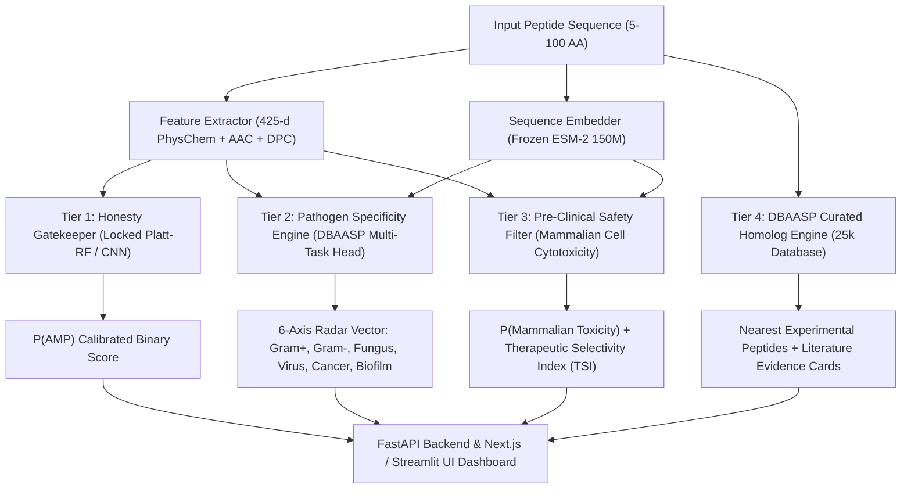

# Implementation Plan: Integrating DBAASP into AMPscan (AMPscan Pro)

## Goal Description
Transform **AMPscan** from a standalone binary classifier (DRAMP-trained, Platt-calibrated Random Forest with 1D-CNN explainability) into **AMPscan Pro: A Multi-Tiered Antimicrobial Discovery and Triage Platform**.

Using the newly compiled [master_DBAASP.csv](file:///home/sudheesh02/SIH%20TEST/DBAASP/master_DBAASP.csv) and [master_DBAASP.fasta](file:///home/sudheesh02/SIH%20TEST/DBAASP/master_DBAASP.fasta) (25,070 curated records with ~15,800 truly novel positive sequences, multi-pathogen spectrum annotations, and 13,885 mammalian cytotoxicity flags), this plan implements:
1. **Tier 1 — External Blind Validation & Out-Of-Distribution (OOD) Benchmark**: Zero-shot evaluation of locked AMPscan models on novel DBAASP scaffolds partitioned with MMseqs2 (<30% sequence identity to training set).
2. **Tier 2 — Multi-Label Pathogen Specificity Engine**: 5-target activity spectrum classification (`Gram+`, `Gram-`, `Fungus`, `Virus`, `Cancer`) trained with Asymmetric Loss (ASL).
3. **Tier 3 — Pre-Clinical Safety & Selectivity Filter**: Host cytotoxicity prediction yielding a calibrated **Therapeutic Selectivity Index ($TSI$)** ($SI = \frac{P(\text{AMP})}{P(\text{Tox}) + 10^{-4}}$).
4. **Tier 4 — Full-Stack API, UI & Hackathon Defense Integration**: FastAPI endpoints, Next.js / Streamlit radar charts, safety dials, DBAASP evidence cards, and hackathon judge defense scripts.



---

## User Review Required

> [!IMPORTANT]
> **Preserving Locked Baseline Models**: The current headline metric (Random Forest Homology Test ROC-AUC **0.9515**, Platt ECE **0.0235**) is locked and audited. The DBAASP dataset will **not** overwrite the locked DRAMP test set. Instead, it serves as an **independent external test benchmark** and trains the **Tier 2 (Target Specificity)** and **Tier 3 (Safety Profile)** auxiliary heads.

> [!TIP]
> **Computation & VRAM Budget**: All training and inference workflows are designed to execute within an 8 GB VRAM budget (RTX 5060 Laptop GPU) using frozen ESM-2 embeddings cached to disk and gradient-boosted / multi-task MLP heads.

---

## Open Questions

> [!NOTE]
> 1. **D-Amino Acid Handling in Synthetic Peptides**: 11.54% (2,893 entries) in DBAASP use D-amino acids (encoded as lowercase `k, w, r, l`). Our proposed default is case-folding (`s.upper()`) for standard sequence embedding while encoding a boolean flag `has_d_amino_acids: bool` as an explicit feature.
> 2. **Multi-Chain Peptides**: 672 entries in CSV are multimers (space-delimited chains). Proposed default: process each chain as an independent bioactive sequence in the single-sequence pipelines.
> 3. **UI Scope**: Should we update both the Next.js frontend (`frontend/`) and the Streamlit demo (`app/streamlit_app.py`), or prioritize the FastAPI + Next.js stack first?

---

## Proposed Changes

### Component 1: Data Curation & Featurization Layer

#### [NEW] [scripts/curate_dbaasp_dataset.py](file:///home/sudheesh02/SIH%20TEST/scripts/curate_dbaasp_dataset.py)
Standardizes `master_DBAASP.csv`, builds multi-label target matrices, extracts terminus modifications (`AMD`, `ACT`, lipidations), filters length ($5 \le L \le 100$), and performs MMseqs2 cross-referencing against the locked DRAMP training fold.

```python
"""Curate master_DBAASP.csv into benchmark splits and multi-task datasets."""
import pandas as pd
import numpy as np

def curate_dbaasp(csv_path: str, output_dir: str):
    df = pd.read_csv(csv_path)
    # 1. Monomers & length filtering (5 <= L <= 100)
    df_clean = df[df['COMPLEXITY'] == 'Monomer'].copy()
    df_clean['CLEAN_SEQ'] = df_clean['SEQUENCE'].str.strip().str.upper()
    df_clean = df_clean[df_clean['CLEAN_SEQ'].str.len().between(5, 100)]
    
    # 2. Multi-target binary indicators
    targets = ['Gram+', 'Gram-', 'Fungus', 'Virus', 'Cancer', 'Biofilm', 'Mammalian Cell']
    for t in targets:
        col_name = 'target_' + t.lower().replace('+', '_pos').replace('-', '_neg').replace(' ', '_')
        df_clean[col_name] = df_clean['TARGET GROUP'].fillna('').apply(lambda x: int(t in x))
    
    # 3. Chemical features
    df_clean['is_amidated'] = df_clean['C TERMINUS'].fillna('').str.contains('AMD').astype(int)
    df_clean['is_acetylated'] = df_clean['N TERMINUS'].fillna('').str.contains('ACT').astype(int)
    
    df_clean.to_parquet(f"{output_dir}/dbaasp_curated.parquet", index=False)
```

#### [NEW] [scripts/benchmark_dbaasp_ood.py](file:///home/sudheesh02/SIH%20TEST/scripts/benchmark_dbaasp_ood.py)
Executes zero-shot external benchmarking of locked models (Platt Random Forest and 1D-CNN) against 3 MMseqs2 homology tiers:
- **Tier 1 (Strict OOD)**: $<30\%$ identity to DRAMP train set.
- **Tier 2 (Near-Homologs)**: $30\% \le \text{identity} < 100\%$.
- **Tier 3 (Database Overlaps)**: $100\%$ identity.

---

### Component 2: Multi-Label Specificity & Toxicity Model Training

#### [NEW] [scripts/train_multitask_dbaasp.py](file:///home/sudheesh02/SIH%20TEST/scripts/train_multitask_dbaasp.py)
Trains a multi-head neural network and LightGBM models for:
- **Head 1–5**: `Gram+`, `Gram-`, `Fungus`, `Virus`, `Cancer` activity probabilities with Asymmetric Loss (ASL).
- **Head 6**: `Mammalian Toxicity / Hemolysis` probability ($P(\text{Tox})$) with Platt calibration ($ECE < 0.03$).

```python
"""Multi-task training pipeline with Asymmetric Loss for target specificity."""
import torch
import torch.nn as nn
import torch.nn.functional as F

class AsymmetricLoss(nn.Module):
    def __init__(self, gamma_neg=4, gamma_pos=0, clip=0.05, eps=1e-8):
        super().__init__()
        self.gamma_neg = gamma_neg
        self.gamma_pos = gamma_pos
        self.clip = clip
        self.eps = eps

    def forward(self, x, y):
        # x: logits, y: binary targets
        xs_pos = torch.sigmoid(x)
        xs_neg = 1.0 - xs_pos
        if self.clip is not None and self.clip > 0:
            xs_neg = (xs_neg + self.clip).clamp(max=1)
        los_pos = y * torch.log(xs_pos.clamp(min=self.eps)) * ((1 - xs_pos) ** self.gamma_pos)
        los_neg = (1 - y) * torch.log(xs_neg.clamp(min=self.eps)) * (xs_pos ** self.gamma_neg)
        return -torch.mean(los_pos + los_neg)
```

---

### Component 3: Backend API Service (`services/predict_api/`)

#### [MODIFY] [services/predict_api/scoring.py](file:///home/sudheesh02/SIH%20TEST/services/predict_api/scoring.py)
Extend `ArtifactHolder` to load:
1. `multitask_weights.pt` / `specificity_lgb.pkl`
2. `toxicity_calibrated_model.pkl`
3. Fast in-memory 25k DBAASP k-mer index for instant nearest-neighbor retrieval.
4. Calculate **Therapeutic Selectivity Index ($TSI$)**:
   $$TSI = \frac{P(\text{AMP})}{P(\text{Mammalian Toxicity}) + 10^{-4}}$$

#### [MODIFY] [services/predict_api/main.py](file:///home/sudheesh02/SIH%20TEST/services/predict_api/main.py)
Add four new production endpoints:
- `POST /predict/target-specificity`: Returns 6-axis activity vector.
- `POST /predict/safety-profile`: Returns mammalian toxicity probability, hemolysis risk tier, and TSI score.
- `POST /search/dbaasp-homologs`: Returns top nearest verified DBAASP homologs with literature citations.
- `GET /metrics/external-dbaasp`: Returns frozen model zero-shot evaluation benchmarks on novel DBAASP scaffolds.

---

### Component 4: Frontend UI & Streamlit Dashboard

#### [NEW] [frontend/components/TargetRadarChart.tsx](file:///home/sudheesh02/SIH%20TEST/frontend/components/TargetRadarChart.tsx)
Interactive polar radar chart displaying the 6-axis pathogen specificity profile with live comparison against reference AMP baselines.

#### [NEW] [frontend/components/SafetyProfileCard.tsx](file:///home/sudheesh02/SIH%20TEST/frontend/components/SafetyProfileCard.tsx)
Therapeutic Selectivity Index (TSI) gauge, mammalian cytotoxicity alerts, and chemical terminus recommendation badges.

#### [MODIFY] [frontend/app/predict/page.tsx](file:///home/sudheesh02/SIH%20TEST/frontend/app/predict/page.tsx)
Integrate the Radar Chart and Safety Card alongside the existing HUD Dial and Integrated Gradients heatmap.

#### [MODIFY] [app/streamlit_app.py](file:///home/sudheesh02/SIH%20TEST/app/streamlit_app.py)
Add matplotlib radar polar plots and safety callout boxes to the offline Streamlit fallback app.

---

## Verification Plan

### Automated Tests
1. **Data Curation & Alignment Test**:
   ```bash
   python3 -c "
   import pandas as pd
   df = pd.read_parquet('data/processed/dbaasp_curated.parquet')
   assert len(df) > 20000
   assert set(['target_gram_pos', 'target_gram_neg', 'target_mammalian_cell']).issubset(df.columns)
   print('✅ Curation verification passed.')
   "
   ```
2. **External Blind Validation Run**:
   ```bash
   python3 scripts/benchmark_dbaasp_ood.py --check
   ```
3. **API Endpoint Test Suite**:
   ```bash
   pytest services/predict_api/tests/ -v
   ```
4. **FastAPI Route Validation**:
   ```bash
   curl -X POST http://127.0.0.1:8000/predict/target-specificity -H "Content-Type: application/json" -d '{"sequence": "GIGKFLHSAKKFGKAFVGEIMNS"}'
   curl -X POST http://127.0.0.1:8000/predict/safety-profile -H "Content-Type: application/json" -d '{"sequence": "GIGKFLHSAKKFGKAFVGEIMNS"}'
   ```

### Manual Verification
1. **Workbench Visual Audit**: Open Next.js UI (`localhost:3000/predict`), paste canonical Magainin-2 (`GIGKFLHSAKKFGKAFVGEIMNS`), verify that:
   - Primary dial displays calibrated P(AMP) ~0.99.
   - Radar chart lights up Gram+ and Gram- axes.
   - Safety card displays favorable Therapeutic Selectivity Index.
   - DBAASP Homolog Card cites verified Magainin entry with literature.
2. **Offline Fallback Check**: Launch Streamlit app (`streamlit run app/streamlit_app.py`), upload a FASTA file, and verify polar plots render cleanly without web access.
