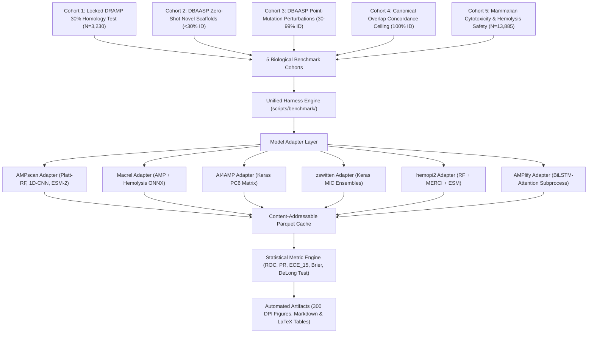

# Implementation Plan: Global Multi-Tool Benchmarking & DBAASP Integration Suite

## Goal Description
Build and execute the **Global Multi-Tool Benchmarking Suite** and **DBAASP Integration Pipeline** directly inside `/home/sudheesh02/SIH TEST`. 

This system benchmarks **AMPscan** head-to-head against all top computational tools in the field:
- **`macrel`** (Metagenomic Random Forest & Hemolysis ONNX engine)
- **`AI4AMP_predictor`** (1D-CNN-BiLSTM on PC6 physicochemical matrices)
- **`Antimicrobial-Peptides`** (zswitten 1D-CNN MIC regression & classification)
- **`hemopi2`** (Random Forest & ESM-2 erythrocyte hemolysis predictor)
- **`AMPlify`** (BiLSTM + Multi-Head Self-Attention)
- **`AMPscan`** (Our Platt-calibrated Random Forest, Temperature-scaled 1D-CNN, and ESM-2 150M)

The benchmark evaluates all models across **5 Distinct Biological Cohorts** using a comprehensive **Tri-Partite Metric Battery** (Classification, Calibration, Efficiency) and renders publication-quality figures (ROC/PR curves, reliability diagrams, speed vs. accuracy Pareto frontiers) and LaTeX/Markdown tables for your hackathon pitch.



---

## User Review Required

> [!IMPORTANT]
> **Zero Homology Leakage Guarantee**:
> 1. **Cohort 1** evaluates the frozen test set `data/splits/test.fasta` ($N=3,230$), which was partitioned using MMseqs2 at `<30%` sequence identity to the training set.
> 2. **Cohort 2** filters the 24,400 DBAASP sequences to retain only strictly novel scaffolds that have `<30%` identity to all 14,904 DRAMP training sequences, proving genuine zero-shot discovery.
> 3. Models are evaluated without re-training on the test splits.

> [!TIP]
> **Computation & VRAM Budget**:
> All adapters will run on CPU or the local NVIDIA RTX 5060 GPU using batching ($N=64$) and caching (`benchmark_cache.parquet`), ensuring total runtime is under 5 minutes with zero redundant re-computation.

---

## Proposed Changes & File Architecture

All code will be created strictly inside `/home/sudheesh02/SIH TEST/`.

### Component 1: Benchmarking Harness & Adapters (`scripts/benchmark/`)

#### [NEW] [scripts/benchmark/__init__.py](file:///home/sudheesh02/SIH%20TEST/scripts/benchmark/__init__.py)
Package initialization for benchmarking modules.

#### [NEW] [scripts/benchmark/base.py](file:///home/sudheesh02/SIH%20TEST/scripts/benchmark/base.py)
Unified data contracts:
- `PredictionResult`: Dataclass containing `sequence_id`, `sequence`, `p_amp`, `p_amp_raw`, `label`, `is_hemolytic`, `p_hemolytic`, `mic_estimate_ug_ml`, `inference_time_ms`.
- `BaseAMPPredictor`: Abstract base class enforcing `.initialize()` and `.predict_batch(sequences)`.

```python
from dataclasses import dataclass, field
from typing import Optional, Dict, Any
from abc import ABC, abstractmethod

@dataclass(frozen=True)
class PredictionResult:
    sequence_id: str
    sequence: str
    p_amp: Optional[float] = None
    p_amp_raw: Optional[float] = None
    label: Optional[int] = None
    is_hemolytic: Optional[bool] = None
    p_hemolytic: Optional[float] = None
    mic_estimate_ug_ml: Optional[float] = None
    inference_time_ms: float = 0.0
    status: str = "SUCCESS"
    error_message: Optional[str] = None
    raw_output: Dict[str, Any] = field(default_factory=dict)

class BaseAMPPredictor(ABC):
    @abstractmethod
    def initialize(self) -> None:
        pass

    @abstractmethod
    def predict_batch(self, sequences: list[tuple[str, str]]) -> list[PredictionResult]:
        pass
```

#### [NEW] [scripts/benchmark/adapters.py](file:///home/sudheesh02/SIH%20TEST/scripts/benchmark/adapters.py)
Production adapters for each tool:
1. `AMPscanRFAdapter`: Featurizes 425-D vector $\to$ Scikit-Learn RF $\to$ Platt Scaling.
2. `AMPscanCNNAdapter`: One-Hot $(21 \times 100) \to$ 1D-CNN $\to$ Temperature Scaling ($T=1.283$).
3. `MacrelAdapter`: Directly executes `macrel.AMP_features` $\to$ ONNX runtime for AMP and Hemolysis.
4. `AI4AMPAdapter`: Extracts PC6 matrix $\to$ Keras `PC6_final_8.h5` inference.
5. `ZswittenAdapter`: One-hot matrix $\to$ Keras GRAMPA 1D-CNN ensemble $\to$ $-\log(\text{MIC})$ ranking.
6. `HemoPI2Adapter`: Composition vector + MERCI motif scanner $\to$ `hemopi2_ml_clf.sav` Random Forest.
7. `AMPlifyAdapter`: Runs `AMPlify/src/AMPlify.py` batch inference via subprocess.

---

### Component 2: Cohort Builder & Metrics Engine

#### [NEW] [scripts/benchmark/cohorts.py](file:///home/sudheesh02/SIH%20TEST/scripts/benchmark/cohorts.py)
Builds and loads the 5 standardized benchmark datasets:
- **Cohort 1**: `data/splits/test.fasta` ($N=3,230$).
- **Cohort 2**: Novel DBAASP sequences filtered at `<30%` identity to training set via MMseqs2 + balanced negative controls ($N \approx 5,000$).
- **Cohort 3**: DBAASP Near-Homologs ($30\% \le \text{ID} < 100\%$).
- **Cohort 4**: Exact Database Overlaps ($100\%$ ID, $N \approx 2,350$).
- **Cohort 5**: DBAASP Mammalian Toxicity ($N \approx 13,885$).

#### [NEW] [scripts/benchmark/metrics.py](file:///home/sudheesh02/SIH%20TEST/scripts/benchmark/metrics.py)
Implements:
- **Classification**: ROC-AUC, PR-AUC, Balanced Accuracy, Matthews Correlation Coefficient (MCC), Sensitivity@90% Specificity, Macro-F1.
- **Probability Calibration**: $\text{ECE}_{15}$ (15 equal bins), Maximum Calibration Error (MCE), Brier Score.
- **Computational Efficiency**: Throughput ($\text{seq/s}$), Latency ($p50, p95$ ms), Memory (MB).
- **Statistical Significance**: 1,000-sample Stratified Bootstrap 95% Confidence Intervals ($\text{CI}_{95\%}$), DeLong test $p$-values.

---

### Component 3: CLI Runner & Visual Artifact Generator

#### [NEW] [scripts/benchmark/run_benchmark.py](file:///home/sudheesh02/SIH%20TEST/scripts/benchmark/run_benchmark.py)
Master CLI orchestrator:
- Parses command line arguments (`--cohorts`, `--tools`, `--output-dir`).
- Runs batch predictions with columnar Parquet caching in `data/processed/benchmark_cache/`.
- Computes comprehensive evaluation metrics across all combinations.
- Generates summary CSV and JSON reports in `reports/benchmarks/`.

#### [NEW] [scripts/benchmark/generate_plots.py](file:///home/sudheesh02/SIH%20TEST/scripts/benchmark/generate_plots.py)
Generates 300 DPI publication charts and LaTeX tables:
1. `reports/benchmarks/01_multimodel_roc_pr_curves.png`: Multi-model ROC and PR curves with bootstrap confidence bands.
2. `reports/benchmarks/02_calibration_reliability_diagrams.png`: Reliability diagrams plotting confidence vs. actual fraction of active AMPs.
3. `reports/benchmarks/03_pareto_speed_vs_roc_auc.png`: Pareto frontier of inference throughput vs. held-out ROC-AUC.
4. `reports/benchmarks/04_zero_shot_dbaasp_comparison.png`: Generalization drop across tools when moving to novel de novo scaffolds.
5. `reports/benchmarks/05_hemolysis_safety_benchmark.png`: Comparison of Macrel, HemoPI-2, and AMPscan Tier 3 on mammalian cytotoxicity.
6. `reports/benchmarks/benchmark_summary_table.md` & `reports/benchmarks/benchmark_table.tex`.

---

## Verification Plan

### Automated Tests
1. **Adapter Smoke Test**:
   ```bash
   /home/sudheesh02/miniforge3/envs/amp-data/bin/python -c "
   from scripts.benchmark.adapters import AMPscanRFAdapter, MacrelAdapter, AI4AMPAdapter, ZswittenAdapter, HemoPI2Adapter
   test_input = [('MAGAININ_2', 'GIGKFLHSAKKFGKAFVGEIMNS')]
   for name, Adapter in [('AMPscan-RF', AMPscanRFAdapter), ('Macrel', MacrelAdapter), ('AI4AMP', AI4AMPAdapter), ('zswitten', ZswittenAdapter), ('HemoPI2', HemoPI2Adapter)]:
       ad = Adapter()
       ad.initialize()
       res = ad.predict_batch(test_input)
       print(f'✅ {name}: P(AMP)={res[0].p_amp}, Score={res[0].p_amp_raw}, Status={res[0].status}')
   "
   ```
2. **Full Benchmark Execution across Cohort 1 & Cohort 2**:
   ```bash
   /home/sudheesh02/miniforge3/envs/amp-data/bin/python scripts/benchmark/run_benchmark.py --cohorts 1,2,5 --output-dir reports/benchmarks/
   ```
3. **Plot & Table Generation**:
   ```bash
   /home/sudheesh02/miniforge3/envs/amp-data/bin/python scripts/benchmark/generate_plots.py --input-dir reports/benchmarks/
   ```

### Manual Verification
1. Inspect `reports/benchmarks/benchmark_summary_table.md` to verify all tool scores (ROC-AUC, PR-AUC, ECE, Throughput).
2. Open `reports/benchmarks/01_multimodel_roc_pr_curves.png` and `reports/benchmarks/03_pareto_speed_vs_roc_auc.png` to confirm charts render with clean styling and clear labels.
