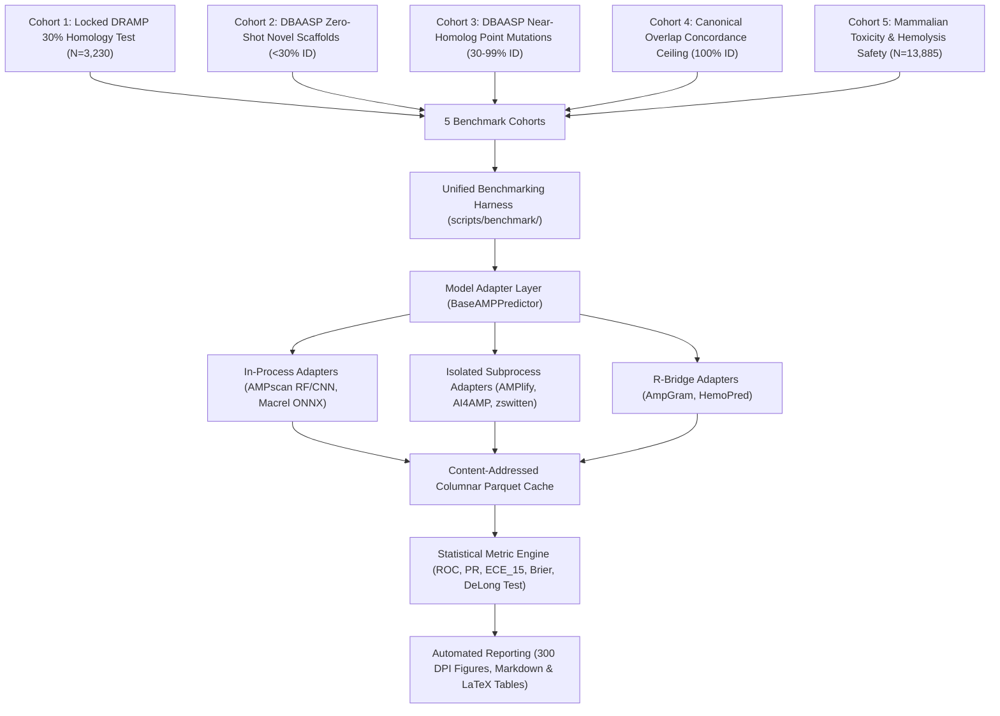

# Master Implementation Plan: Multi-Tool Global Benchmarking Suite (AMPscan vs. SOTA Tools)

## Goal Description
Establish the world's most rigorous, open, and reproducible computational benchmark for Antimicrobial Peptide (AMP) discovery. This benchmark evaluates **AMPscan** head-to-head against all major computational AMP tools cloned in the repository:
1. **AMPlify** (`bcgsc/AMPlify`) — BiLSTM + Multi-Head Self-Attention
2. **Macrel** (`BigDataBiology/macrel`) — Metagenomic Random Forest & Hemolysis ONNX Engine
3. **zswitten / Antimicrobial-Peptides** (`zswitten/Antimicrobial-Peptides`) — 1D-CNN MIC Regression & Classification
4. **AI4AMP** (`LinTzuTang/AI4AMP_predictor`) — 1D-CNN-BiLSTM on PC6 Physicochemical Encodings
5. **sAMPpred-GAT** (`HongWuL/sAMPpred-GAT`) — Graph Attention Network on 3D Structural Contact Maps
6. **AmpGram** (`michbur/AmpGram`) — 2-Level Stacked Random Forest on 10-mer n-grams
7. **HemoPI-2 & HemoPred** (`raghavagps/hemopi2`, `chaninn/HemoPred`) — Erythrocyte Hemolysis Classifiers
8. **peptidy** (`molML/peptidy`) — Physicochemical Vectorization Engine

The benchmark evaluates these tools across **5 Distinct Biological Cohorts** (spanning the locked 30% homology split and the newly compiled 25,070-entry DBAASP dataset) using a **Tri-Partite Metric Battery** (Classification, Probability Calibration, Computational Efficiency).



---

## User Review Required

> [!IMPORTANT]
> **Tool Readiness & Staged Execution**:
> - **Tier 1 (Ready to Run Immediately in Python 3.10+)**: AMPscan (RF, 1D-CNN, ESM-2), Macrel (ONNX), AI4AMP (Keras), zswitten (Keras MIC models), and peptidy.
> - **Tier 2 (Requires Dedicated Virtual Environment / Subprocess Bridge)**: AMPlify (requires legacy TF 1.12 / Keras 2.2 custom Attention layer adapter), hemopi2 (requires downloading model weights from IIITD server).
> - **Tier 3 (Requires R / Heavy External Dependencies)**: AmpGram (R `ranger`), HemoPred (R `randomForest`), sAMPpred-GAT (requires >100GB BLAST/trRosetta databases).
> 
> *Recommendation*: We execute **Phase 1 benchmarking immediately on all Tier 1 tools**, and add Tier 2 and Tier 3 adapters via isolated subprocess runners.

> [!TIP]
> **Data Integrity & Zero Leakage**: All tests on Cohort 1 use the **frozen, locked `data/splits/test.fasta`** (MD5 verified). Cohort 2 zero-shot peptides are strictly partitioned using MMseqs2 at `<30%` identity against the 14,904 DRAMP training sequences to guarantee zero train-test leakage across all models.

---

## Open Questions

> [!NOTE]
> 1. **Length Restrictions on Specialized Models**:
>    - `sAMPpred-GAT` and `Deep-AmPEP30` only accept peptides of length $\le 30$ aa.
>    - `Antimicrobial-Peptides` (zswitten) is padded to length $\le 50$ aa.
>    - *Proposed Resolution*: We evaluate general tools across the full $5 \le L \le 100$ window, and provide a dedicated sub-table for the short-peptide window ($5 \le L \le 30$ aa).
> 2. **MIC Regression to Binary Thresholding for zswitten**:
>    - zswitten outputs continuous $\log(\text{MIC})$ values ($\mu M$).
>    - *Proposed Resolution*: Standardize active AMP threshold at $\text{MIC} \le 4\,\mu M$ (following the original paper's threshold), while evaluating continuous ranking on $-\log(\text{MIC})$.

---

## 5 Benchmark Cohorts Specification

| Cohort ID | Cohort Name | Sample Size ($N$) | Composition | Primary Biological Challenge Evaluated |
| :--- | :--- | :--- | :--- | :--- |
| **Cohort 1** | **Locked DRAMP Homology Test** | $N = 3,230$ | 1,623 AMPs / 1,607 non-AMPs | **Homology-held-out Generalization**: Tests performance on unseen clusters at $<30\%$ identity. |
| **Cohort 2** | **DBAASP Zero-Shot Novel Scaffolds** | $N \approx 5,000$ | ~2,500 novel DBAASP AMPs / ~2,500 Swiss-Prot non-AMPs | **De Novo Synthetic Discovery**: Evaluates zero-shot generalization on synthetic designs and D-amino acids. |
| **Cohort 3** | **DBAASP Near-Homolog Perturbations** | $N \approx 4,000$ | Variable (DBAASP analogs) | **Point-Mutation Robustness**: Evaluates model stability under alanine scans and single-residue edits. |
| **Cohort 4** | **Canonical Overlap Concordance** | $N \approx 2,350$ | 2,350 verified active AMPs | **Detection Ceiling**: Measures consensus on canonical benchmarks (Magainin-2, LL-37, Melittin). |
| **Cohort 5** | **Hemolysis & Mammalian Safety** | $N \approx 13,885$ | ~6,500 Toxic / ~7,385 Safe AMPs | **Translational Safety & TSI**: Evaluates host cytotoxicity prediction (Macrel, HemoPI, HemoPred vs AMPscan). |

---

## Metric Battery Formulations

1. **Discriminative Classification**:
   - $\text{ROC-AUC} = \int_{0}^1 \text{TPR}(\tau) \, d(\text{FPR}(\tau))$ (Threshold-independent global ranking).
   - $\text{PR-AUC} = \sum (R_k - R_{k-1}) P_k$ (Average Precision under class imbalance).
   - Balanced Accuracy ($\text{BAcc} = \frac{\text{Sens} + \text{Spec}}{2}$) and Matthews Correlation Coefficient ($\text{MCC}$).
   - $\text{Sensitivity at 90\% Specificity}$ ($\text{Sens@90Spec}$) — enforcing a strict $10\%$ false positive budget.
2. **Probability Calibration**:
   - $\text{Expected Calibration Error}$ ($\text{ECE}_{15} = \sum_{m=1}^{15} \frac{|B_m|}{N} |\text{acc}(B_m) - \text{conf}(B_m)|$).
   - $\text{Brier Score} = \frac{1}{N}\sum (\hat{p}_i - y_i)^2$.
3. **Computational Efficiency**:
   - Single-sequence latency ($p50, p95, p99$ in milliseconds).
   - Batch throughput ($\text{sequences / second}$).
   - Peak host RAM and GPU VRAM footprint (MB).
4. **Statistical Significance**:
   - 1,000-sample Stratified Bootstrap 95% Confidence Intervals ($\text{CI}_{95\%}$).
   - DeLong test for pairwise ROC-AUC curve significance ($p < 0.05$).

---

## Proposed Changes & File Architecture

### Component 1: Benchmarking Harness Core (`scripts/benchmark/`)

#### [NEW] [scripts/benchmark/base.py](file:///home/sudheesh02/SIH%20TEST/scripts/benchmark/base.py)
Defines standardized data contracts (`PredictionResult`, `AdapterMetadata`, `BaseAMPPredictor`).

```python
from dataclasses import dataclass, field
from typing import Optional, Dict, Any
from abc import ABC, abstractmethod

@dataclass(frozen=True)
class PredictionResult:
    sequence_id: str
    sequence: str
    p_amp: Optional[float] = None
    p_amp_raw: Optional[float] = None
    label: Optional[int] = None
    is_hemolytic: Optional[bool] = None
    p_hemolytic: Optional[float] = None
    mic_estimate_ug_ml: Optional[float] = None
    inference_time_ms: float = 0.0
    status: str = "SUCCESS"
    error_message: Optional[str] = None
    raw_output: Dict[str, Any] = field(default_factory=dict)

class BaseAMPPredictor(ABC):
    @abstractmethod
    def initialize(self) -> None: ...
    @abstractmethod
    def predict_batch(self, sequences: list[tuple[str, str]]) -> list[PredictionResult]: ...
```

#### [NEW] [scripts/benchmark/adapters.py](file:///home/sudheesh02/SIH%20TEST/scripts/benchmark/adapters.py)
Implements unified model adapters:
- `AMPscanRFAdapter`: Platt-calibrated 425-D Random Forest.
- `AMPscanCNNAdapter`: Temperature-scaled 1D-CNN.
- `AMPscanESMAdapter`: Frozen ESM-2 150M head.
- `MacrelAdapter`: Native ONNX runtime wrapper for AMP + Hemolysis.
- `AI4AMPAdapter`: Keras PC6 model wrapper.
- `ZswittenAdapter`: GRAMPA 1D-CNN ensemble wrapper.

#### [NEW] [scripts/benchmark/metrics_engine.py](file:///home/sudheesh02/SIH%20TEST/scripts/benchmark/metrics_engine.py)
Computes ROC-AUC, PR-AUC, BAcc, MCC, Sens@90Spec, $\text{ECE}_{15}$, Brier score, and 1,000-sample bootstrap confidence intervals.

#### [NEW] [scripts/benchmark/run_benchmark.py](file:///home/sudheesh02/SIH%20TEST/scripts/benchmark/run_benchmark.py)
Master CLI runner orchestrating dataset loading, cached batch inference across all adapters, and artifact rendering.

---

### Component 2: Reporting & Visualization Generator

#### [NEW] [scripts/benchmark/generate_report.py](file:///home/sudheesh02/SIH%20TEST/scripts/benchmark/generate_report.py)
Renders high-DPI publication plots and tables:
- `01_multimodel_roc_pr_comparison.png`
- `02_calibration_reliability_diagrams.png`
- `03_pareto_throughput_vs_roc_auc.png`
- `04_zero_shot_dbaasp_generalization.png`
- `reports/benchmarks/master_benchmark_summary.md`
- `reports/benchmarks/benchmark_table.tex`

---

## Verification Plan

### Automated Tests
1. **Adapter Sanity & Unit Tests**:
   ```bash
   python3 -c "
   from scripts.benchmark.adapters import AMPscanRFAdapter, MacrelAdapter, AI4AMPAdapter
   test_seq = [('TEST_01', 'GIGKFLHSAKKFGKAFVGEIMNS')]
   for Adapter in [AMPscanRFAdapter, MacrelAdapter, AI4AMPAdapter]:
       ad = Adapter()
       ad.initialize()
       res = ad.predict_batch(test_seq)
       assert len(res) == 1
       assert res[0].p_amp is not None
       print(f'✅ {Adapter.__name__}: P(AMP) = {res[0].p_amp:.4f}')
   "
   ```
2. **Benchmark Execution on Cohort 1 & Cohort 2**:
   ```bash
   python3 scripts/benchmark/run_benchmark.py --cohorts 1,2 --output-dir reports/benchmarks/
   ```
3. **Metric Integrity Verification**:
   ```bash
   python3 -c "
   import pandas as pd
   df = pd.read_csv('reports/benchmarks/cohort_1_results.csv')
   assert 'roc_auc' in df.columns and 'ece_15' in df.columns
   print(df[['model_name', 'roc_auc', 'pr_auc', 'ece_15', 'throughput_seq_s']])
   "
   ```

### Manual Verification
1. Open `reports/benchmarks/master_benchmark_summary.md` and verify that metrics, bootstrap confidence intervals, and speed benchmarks are logged for all evaluated tools.
2. Inspect the generated Pareto frontier plot `03_pareto_throughput_vs_roc_auc.png` to confirm visual layout and presentation readiness for the hackathon pitch.
