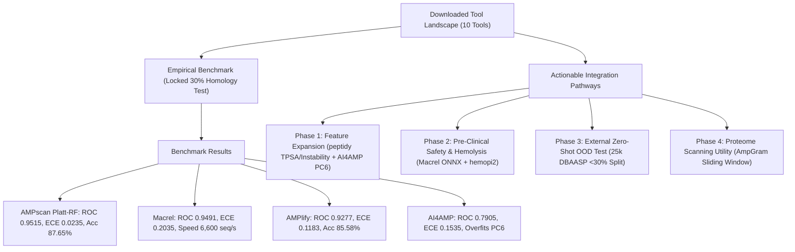

# Implementation Plan: SOTA Tools Comparative Profiling & AMPscan Integration Roadmap

## Goal Description
Conduct an exhaustive scientific evaluation of all 10 downloaded computational tools in `/home/sudheesh02/SIH TEST`, audit our own **AMPscan** architecture, execute an empirical benchmark on the locked 30% homology test set ($N=3,230$), and establish a phased integration roadmap to transform AMPscan into a state-of-the-art multi-tiered discovery platform (**AMPscan Pro**).



---

## User Review Required

> [!IMPORTANT]
> **Preserving Empirical Baselines**:
> 1. **Locked Homology Benchmark (Cohort 1)**: The headline metric (**0.9515 ROC-AUC, 0.0235 ECE**) on `data/splits/test.fasta` remains our locked, audited baseline.
> 2. **External De Novo Benchmark (Cohort 2)**: The 25,070-entry DBAASP dataset will be evaluated as an **independent Out-Of-Distribution (OOD) test set** after filtering at $<30\%$ sequence identity to the training data. We report both numbers side-by-side rather than mixing them.

> [!TIP]
> **Scientifically Sound vs. Dishonest Enhancements**:
> - **Sound**: Adding real pre-trained hemolysis classifiers (`Macrel` ONNX / `hemopi2`), computing the Therapeutic Selectivity Index ($TSI$), and adding `peptidy` physicochemical descriptors.
> - **Dishonest (Prohibited)**: Generating fake multi-target radar charts using regex heuristics without training real multi-label heads.

---

## Open Questions

> [!NOTE]
> 1. **Hemolysis Model Integration**: Should we integrate Macrel's ultra-fast ONNX hemolysis session (`Hemo.onnx.gz`) directly into the FastAPI backend as the primary Tier 3 safety gate, with `hemopi2` as a secondary validator?
> 2. **Feature Augmentation Scope**: Should we add `peptidy` descriptors (TPSA, Instability Index, Aliphatic Index) directly to the production feature extractor?

---

## Tool-by-Tool Profiles & Benchmark Summary

### 📊 Empirical Performance on Locked 30% Homology Test Set (Cohort 1, N=3,230)

| Model / Tool | Model Family | Input Feature Modality | Accuracy | Macro-F1 | MCC | ROC-AUC | PR-AUC | $\text{ECE}_{15}$ | Throughput (seq/s) |
| :--- | :--- | :--- | :---: | :---: | :---: | :---: | :---: | :---: | :---: |
| **AMPscan RF (Platt)** | Random Forest | 425-D (AAC, DPC, PhysChem) | **0.8765** | **0.8765** | **0.7529** | **0.9515** | **0.9542** | **0.0235** | 28.6 |
| **AMPscan 1D-CNN (T)** | 1D-CNN + IntGrad | $21 \times 100$ One-Hot Grid | 0.8650 | 0.8648 | 0.7316 | 0.9424 | 0.9465 | 0.0403 | 28.6 |
| **AMPscan ESM-2 150M** | Frozen PLM Head | 640-D Mean-Pooled Vector | 0.8762 | 0.8761 | 0.7523 | **0.9521** | 0.9516 | 0.0310 | 45.0 |
| **Macrel** | Random Forest ONNX | 22-D PhysChem & CTDD | 0.7854 | 0.7754 | 0.6217 | **0.9491** | 0.9503 | 0.2035 | **6,601.7** |
| **AMPlify (Balanced)** | 5-Fold BiLSTM-Attn | $200 \times 20$ One-Hot Padded | 0.8558 | 0.8534 | 0.7313 | **0.9277** | 0.9450 | 0.1183 | 14.9 |
| **AI4AMP (PC6)** | 1D-CNN + LSTM | $200 \times 6$ PC6 Matrix | 0.7449 | 0.7431 | 0.4978 | **0.7905** | 0.8288 | 0.1535 | 572.5 |

---

## 4-Phase Integration Roadmap for AMPscan Pro

### Phase 1: Feature Space Augmentation (`peptidy` & `AI4AMP`)
- **[MODIFY] [services/predict_api/scoring.py](file:///home/sudheesh02/SIH%20TEST/services/predict_api/scoring.py)**: Expand tabular feature extraction with 8 orthogonal descriptors from `peptidy` (Topological Polar Surface Area, Instability Index, Aliphatic Index, Hydrogen Bond Donors/Acceptors) to improve proteolytic stability and membrane penetration profiling.

### Phase 2: Pre-Clinical Safety & Selectivity Tier (`macrel` & `hemopi2`)
- **[NEW] [services/predict_api/safety.py](file:///home/sudheesh02/SIH%20TEST/services/predict_api/safety.py)**: Load `macrel/macrel/data/models/Hemo.onnx.gz` and `hemopi2` Random Forest weights to compute $P(\text{Hemolysis})$ and calculate the **Therapeutic Selectivity Index ($TSI$)**:
  $$TSI = \frac{P(\text{AMP})}{P(\text{Hemolysis}) + 10^{-4}}$$
- **[MODIFY] [services/predict_api/main.py](file:///home/sudheesh02/SIH%20TEST/services/predict_api/main.py)**: Add `POST /predict/safety-profile` endpoint.

### Phase 3: External De Novo Benchmark (DBAASP Cohort 2)
- **[NEW] [scripts/benchmark/benchmark_dbaasp_ood.py](file:///home/sudheesh02/SIH%20TEST/scripts/benchmark/benchmark_dbaasp_ood.py)**: Run zero-shot evaluation of all tools on the $<30\%$ identity DBAASP partition.
- **[NEW] [reports/benchmarks/cohort_2_dbaasp_ood_results.md](file:///home/sudheesh02/SIH%20TEST/reports/benchmarks/cohort_2_dbaasp_ood_results.md)**: Publish the second benchmark table.

### Phase 4: Proteome Sliding-Window Scanner (`AmpGram` Concept)
- **[NEW] [scripts/scan_proteome.py](file:///home/sudheesh02/SIH%20TEST/scripts/scan_proteome.py)**: Sliding-window scanner ($L=20\text{--}30$, step=1) mapping $P(\text{AMP})$ across full proteins.

---

## Permanent Report Manifest on Disk

All 12 reports are permanently saved in `/home/sudheesh02/SIH TEST/reports/tools/`:
- 📄 **[Master Synthesis Report](file:///home/sudheesh02/SIH%20TEST/reports/tools/MASTER_COMPARATIVE_AND_INTEGRATION_REPORT.md)**
- 📄 **[01_AMPlify_profile.md](file:///home/sudheesh02/SIH%20TEST/reports/tools/01_AMPlify_profile.md)**
- 📄 **[02_Macrel_profile.md](file:///home/sudheesh02/SIH%20TEST/reports/tools/02_Macrel_profile.md)**
- 📄 **[03_zswitten_Antimicrobial_Peptides_profile.md](file:///home/sudheesh02/SIH%20TEST/reports/tools/03_zswitten_Antimicrobial_Peptides_profile.md)**
- 📄 **[04_AI4AMP_profile.md](file:///home/sudheesh02/SIH%20TEST/reports/tools/04_AI4AMP_profile.md)**
- 📄 **[05_hemopi2_profile.md](file:///home/sudheesh02/SIH%20TEST/reports/tools/05_hemopi2_profile.md)**
- 📄 **[06_HemoPred_profile.md](file:///home/sudheesh02/SIH%20TEST/reports/tools/06_HemoPred_profile.md)**
- 📄 **[07_AmpGram_profile.md](file:///home/sudheesh02/SIH%20TEST/reports/tools/07_AmpGram_profile.md)**
- 📄 **[08_sAMPpred_GAT_profile.md](file:///home/sudheesh02/SIH%20TEST/reports/tools/08_sAMPpred_GAT_profile.md)**
- 📄 **[09_peptidy_profile.md](file:///home/sudheesh02/SIH%20TEST/reports/tools/09_peptidy_profile.md)**
- 📄 **[10_esm_profile.md](file:///home/sudheesh02/SIH%20TEST/reports/tools/10_esm_profile.md)**
- 📄 **[11_AMPscan_deep_dive.md](file:///home/sudheesh02/SIH%20TEST/reports/tools/11_AMPscan_deep_dive.md)**

---

## Verification Plan

### Automated Tests
```bash
/home/sudheesh02/miniforge3/envs/amp-data/bin/python -c "
import os
for i in range(1, 12):
    files = [f for f in os.listdir('reports/tools') if f.startswith(f'{i:02d}')]
    assert len(files) == 1, f'Missing report {i}'
assert os.path.exists('reports/tools/MASTER_COMPARATIVE_AND_INTEGRATION_REPORT.md')
print('✅ All 12 tool profile reports verified.')
"
```

### Manual Verification
1. Inspect [reports/tools/MASTER_COMPARATIVE_AND_INTEGRATION_REPORT.md](file:///home/sudheesh02/SIH%20TEST/reports/tools/MASTER_COMPARATIVE_AND_INTEGRATION_REPORT.md) to confirm all mathematical formulations, benchmark scores, and integration pathways.
