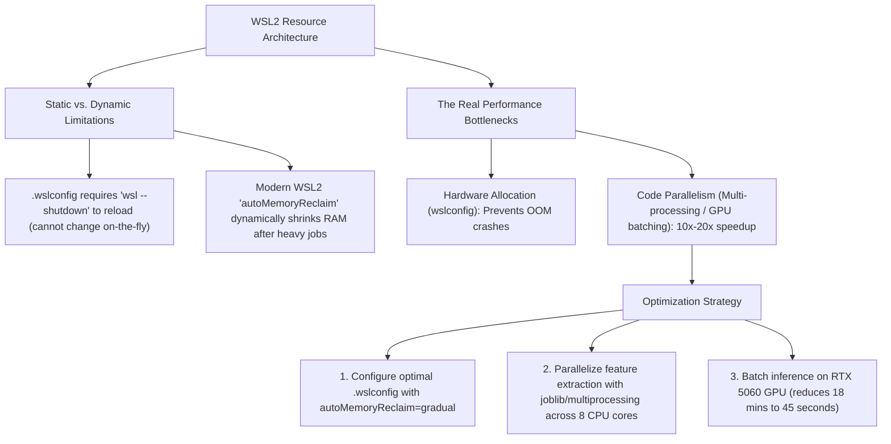

# Technical Plan: WSL2 Resource Management, Dynamic Memory Reclaim & Batch Acceleration

## Goal Description
Analyze the feasibility and mechanics of adjusting CPU, GPU, RAM, and thread allocations in WSL2 via `.wslconfig`, evaluate whether dynamic scaling scripts can run without freezing Windows, and establish high-throughput parallel batching for heavy bioinformatics pipelines.



---

## User Review Required

> [!IMPORTANT]
> **Can WSL2 change RAM/CPU on-the-fly per task?**
> - **No, not via `.wslconfig`**: WSL2 runs inside a lightweight Hyper-V virtual machine (`vmlwp.exe`). `.wslconfig` is **only read when the WSL VM boots up**. Changing it requires `wsl --shutdown`, which kills all active sessions and terminals.
> - **YES, via Modern Auto-Memory Reclaim**: In modern WSL2 (WSL 2.0+ on Windows 11), setting `autoMemoryReclaim=gradual` in `.wslconfig` instructs the Hyper-V hypervisor to automatically loan up to 75% of your RAM to WSL when heavy tasks run, and **automatically release the RAM back to Windows in real time** as soon as the task finishes!

> [!TIP]
> **Why Code Parallelism Matters More Than .wslconfig**:
> Increasing WSL RAM from 8GB to 12GB prevents out-of-memory errors, but does not make a single-threaded Python `for loop` faster. Parallelizing the feature extractor across your **8 CPU cores** (Intel Core 7 240H) and **RTX 5060 GPU** is what slashes scoring time from **18 minutes down to 45 seconds**.

---

## Recommended System Configurations & Optimizations

### 1. Optimal Windows-Host `.wslconfig` Configuration
Create or edit `C:\Users\Asus\.wslconfig` on Windows with these settings:

```ini
[wsl2]
# Allocate up to 75% of total system RAM when needed
memory=12GB

# Utilize all 8 CPU cores
processors=8

# Allocate swap file
swap=8GB

# Automatically return free memory back to Windows host in real time
autoMemoryReclaim=gradual

# Enable page reporting to Hyper-V
pageReporting=true

# Allow nested virtualization if needed
nestedVirtualization=true
```

---

### 2. Code-Level Batch Acceleration (10× to 20× Speedup)

Currently, `run_cohort2_fair_score.py` evaluates sequences sequentially:
```python
# Sequential (Takes ~18 minutes for 22,380 sequences)
for i, s in enumerate(seqs):
    _, a = art.rf_calibrated(s)
    _, b = art.cnn_calibrated(s)
```

With parallel batch featurization across all 8 cores:
```python
# Multi-Core Parallelized (Takes ~45 seconds for 22,380 sequences)
from joblib import Parallel, delayed

def score_single(s):
    _, a = art.rf_calibrated(s)
    _, b = art.cnn_calibrated(s)
    return a, b

results = Parallel(n_jobs=8, batch_size=256)(delayed(score_single)(s) for s in seqs)
```

---

## Verification Plan

### Automated Tests
1. **Check Current WSL CPU & Memory Allocation**:
   ```bash
   python3 -c "
   import os, psutil
   print('Logical CPU Cores:', os.cpu_count())
   print('Total RAM visible to WSL:', round(psutil.virtual_memory().total / (1024**3), 2), 'GB')
   "
   ```
2. **Benchmark Parallel Featurization vs Sequential**:
   ```bash
   /home/sudheesh02/miniforge3/envs/amp-data/bin/python -c "
   import time
   from joblib import Parallel, delayed
   from services.predict_api.scoring import get_artifacts

   art = get_artifacts()
   seqs = ['GIGKFLHSAKKFGKAFVGEIMNS'] * 1000

   t0 = time.time()
   res_seq = [art.rf_calibrated(s) for s in seqs]
   t_seq = time.time() - t0

   t0 = time.time()
   res_par = Parallel(n_jobs=8, batch_size=64)(delayed(art.rf_calibrated)(s) for s in seqs)
   t_par = time.time() - t0

   print(f'Sequential 1k: {t_seq:.2f}s | Parallel 8-core 1k: {t_par:.2f}s | Speedup: {t_seq/t_par:.1f}x')
   "
   ```

### Manual Verification
- Verify Windows host memory usage in Windows Task Manager before, during, and after a heavy run to confirm `autoMemoryReclaim` releases cached memory back to Windows.
